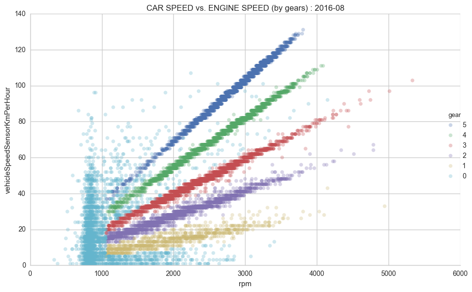

# Metromile Data Analysis

## Guessing Gear Ratios 

### Overview

The program ```guess_car_specs.py``` guesses the gear ratios in a vehicle's transmission based on a sample of its driving data. The driving data is collected via a device plugged in the OBD-II port and warehoused by Metromile (an insurance company) and is available to customers by request. 

The program's underlying operation relies heavily on an unsupervised machine learning clustering algorithm called 'mean shift'. The values of the gear ratios correspond to the N most populous mean shift cluster centers, where N is the number of gears (non-Reverse) in the vehicle's transmission. 

### Instructions

0. Clone this directory onto your local machine and change directories into it from the command line.

1. Request (from the bottom of the Account Settings page while logged into the dashboard) and download your Metromile data. Also you will need information about your car including:
  * Tire diameter (in.)
  * Number of gears (excluding Reverse)
  * [optional] : Axle Ratio

2. Unzip your MetroMile data. The directory it creates should look like: ```123456789 all_driving_data``` (if your account number was 123456789).

3. Move (or copy) this directory and all of its contents into the ```metromile``` directory. 

4. With ```metromile``` as the current working directory, run the script from the command line:
```python guess_car_specs.py```

For a single month of driving data of your specification the script will generate a series of visualizations then guess the gear ratios. The prompts will collect information to subset and assist the program. Here is a sample input/output from my driving history from the month 2016-08:

```
Enter month number : [1, 2, ..., 12] : 8

Enter year (e.g. 2016) : 2016

Enter number of (non-reverse) gears : 5

Enter the tire diameter in inches : 26.5

If known, enter the axle ratio. If not, hit [return] : 

Best guesses for Gear Ratios:
Gear 1 : 3.88
Gear 2 : 1.99
Gear 3 : 1.39
Gear 4 : 1.00
Gear 5 : 0.79
```

Each of the gear ratios are expressed in engine speed/axle speed. For example, the program computed 5th gear as having 0.79 engine revolutions for each 1 axle revolution.

I found a reasonably credible place to crosscheck the program output with my vehicle's specifications here: https://www.driverside.com/specs/chevrolet-tracker-2002-3705-7680-0?style_id=22075


### Further Work 

The program is also enabled to label the original dataset with the gear assumed for each datapoint:



However, there are a few issues with the labeling:

1. Datapoints not found to be in the clusters corresponding to the likely gear ratios are given a 0 value to denote neutral. There are many datapoints sampled belonging to this class, as visible in the scatterplot above. Some datapoints, such as those with non-idling engine speeds but belonging outside an expected ratio of vehicle/engine speed are probably the result of clutching. It's unclear how to classify these accurately.

2. The Reverse gear has a ratio very close to that of 1st gear for many vehicles. It's possible that datapoints belonging to the vehicle while in reverse are being conflated with those of 1st gear. 

3. A hard cutoff on a fixed RPM is probably not realistic for separating engine-idling neutral datapoints from those belonging to a gear. For example, some low speed/low rpm datapoints may be falsely categorized as neutral instead of 1st gear. Similarly, some high speed/low rpm datapoints may be falsely categorized as top gear instead of neutral.

While refining the operation of the program's classification process to better address issues 1-3 described above is desirable, a very complex combination of transformations and obscure clustering algorithms is not necessarily the best course of action. The answer may be simply to conservatively classify, and err on the side of 'false negatives' (over-assigning dataponts to neutral - gear 0). Later algorithms may be developed in conjunction with time-series analysis to classify the missing datapoints.
